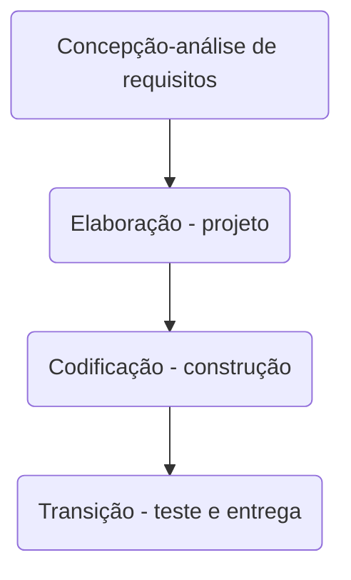

### Fatec ZL - Centro Paula Souza
##### Disciplina - Programação Web III
Grupo X 
- Joaquim da Silva Xavier
- Jose Bonifacio
- Isabel Cristina Leopoldina 

##### Processo de Desenvolvimento de Software - PDS
> O PDS segue uma abordagem interativa incremental. Cada atividade da interação tem uma definição de pronto estabelecida com objetivo de controlar a qualidade. 

- 1-Concepção – visão aproximada, casos de uso de negócio, escopo e estimativas vagas (fase de estudo de viabilidade)
- 2-Elaboração – visão refinada, a arquitetura central é iterativamente implementada e os problemas de alto risco são mitigados, identificação da maioria dos requisitos e do escopo e estimativas mais realistas. 
O projeto de software é iniciado logo que os requisitos de software tenham sido analisados e modelados e prepara a equipe para a transição entre a análise e o código. O projeto arquitetural define os relacionamentos entre os principais elementos estruturais do software (PRESSMAN, 6ed. p. 187). O projeto arquitetural pode ser apresentando na forma de multiplas perpectivas. Krutchen (1995) sugere 4 visões: visão lógica, visão de implementação, visão de processo e visão de instalação. Adcionalmente as 4 visões existe os cenários que determinam a dinâmica e o comportamento da aplicação. Cada cenário descreve como os varios componentes arquiteturais colaboram para manipular uma operação de sistema. 
- 3- Construção – mapeamento do projeto para o código, implementação iterativa dos elementos restantes de menor risco e preparação para implantação. 
- 4 -Transição – beta testes e implantação 
> A definição de "pronto" estabelece como a qualidade será atingida

| Fase | Definição de pronto estabelecida para cada fase - critério de aceitação |
| ------------ | ------------------------------------------------------------------------ |
| Concepção | No inicio da interação a equipe se reune para garantir que existe um entendimento comum entre os envolvidos sobre o comportamento do software. Esta atividade será considerada concluída quando os exemplos de uso são discutidos e existe um "de acordo" no entedimento. Os requisitos serão documentados utilizando "estorias de usuário". Os requisitos serão priorizados (alto, médio ou baixo) de acordo com a complexidade para o desenvolvimento (funções mais complexas são mais sujeitas a falhas) e o perfil operacional de uso (funções mais utilizadas tem um impacto alto na falha). Exemplos de uso da aplicação servem como base na especificação dos casos de teste. | 
| Elaboração | Esta atividade será considerada concluída quando o Diagrama de Classes de Dominio (DCD) (LARMAN, 2006) e um esboço da visão lógica da arquitetura (KRUTCHEN, 2005) for definido e uma análise de rastreabilidade entre o DCD e o documento de requisitos não identificarem inconsistências  |
| Codificação |Será considerada concluída quando a análise de rastreabilidade entre o código e as funções solicitadas no documento de requisitos não identificarem inconsistências   |
| Teste | Será considerada concluída quando 100% dos casos de teste prioritários (complexidade, funções mais utilizadas) rastreáveis para os requisitos obtiverem satisfatório   |

##### Estudo de Caso - SIG de Vendas e Suprimentos
##### Concepção - análise de rquisitos

> Considere que uma organização está iniciando um projeto para implantar um Sistema Integrado de Gestão de Vendas e Suprimentos. 
Os seguintes requisitos foram identificados na primeira reunião com o cliente (RU – Requisito de Usuário). 

- RU01 - Compras - Registra e acompanha os processos de compras na organização, prevê a entrega programada de pedidos de compra
- RU02 - Recebimento - Registra, controla e informa sobre a entrada de mercadorias e integra as informações dos dados da nota fiscal de entrada com o estoque 
- RU03 - Vendas – Registra e acompanha as vendas mantendo as informações integradas com o controle de estoque. 

> Cada requisito tem um identificador único de maneira que seja possível rastrear a necessidade do cliente com a implementação do software. A prioridade é estabelecida considerando o risco de falha. Quanto mais complexa uma função maior é o risco de falha (alto, médio ou baixo). Perfil opercional de uso - quanto mais utilizada for uma função maior será o impacto em uma falha

| Identificador | Descrição | Prioridade |
| ------------ | ------------------------------------------------------------------------ | ------| 
| REQ01 – cadastrar cliente | Como – vendedor, Eu quero – cadastrar o cliente, De maneira que – seja possível identificar o cliente e o endereço de entrega para confirmar uma venda| Média |
| REQ02 – consultar cliente por ID| Como – vendedor, Eu quero – consultar um cliente pelo ID, De maneira que – seja possível obter informações detalhas do cliente | Alta |
| REQ03 – consultar cliente por CPF | Como – vendedor, Eu quero – consultar um cliente, De maneira que – seja possível obter informações detalhas do cliente | Alta |
| REQ04 – consultar todos os clientes | Como – vendedor, Eu quero – consultar todos os clientes cadastrado, De maneira que – seja possível obter uma lista de clientes | Baixa |
| REQ05 – corrigir informações de cliente | Como – vendedor, Eu quero – corrigir as informações do cliente, De maneira que – seja possível manter as informações atualizadas | Baixa |
| REQ06 – excluir cliente | Como – vendedor, Eu quero – excluir um cliente, De maneira que – seja possível manter informações somente de clientes ativos | Baixa |

##### Análise do comportamento
> Exemplos de uso estabelecem o comportamento esperado da aplicação. Os casos de teste (CT) são rastreaveis para os requsiitos (REQ). O elo de rastreabilidade é estabelecido pelo identificador do caso de teste.

| Identificador | Cenário de uso |
| ------------ | ------------------------------------------------------------------------ |
| REQ01CT01 | Dado (setup) que o CPF do cliente não está cadastrado; Quando (ação) o usuário confirma o cadastro; Então (resultado esperado) o sistema envia uma mensagem de cadastro realizado com sucesso |
| REQ01CT02 | Dado (setup) que o CPF do cliente está cadastrado; Quando (ação) o usuário confirma o cadastro; Então (resultado esperado) o sistema rejeita e envia uma mensagem de dados inválidos |

##### Elaboração - projeto

> 
As classes conceituais relacionadas aos requisitos para está interação foram identificadas no modelo de dominio. 
